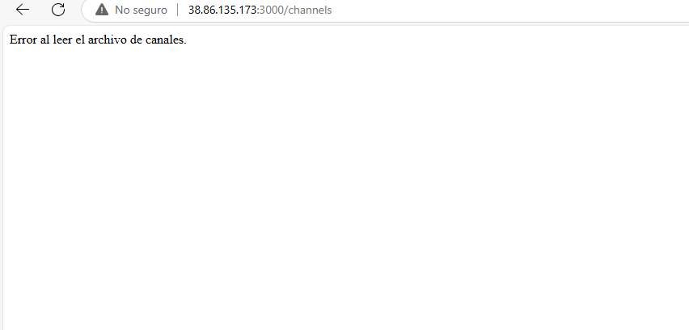
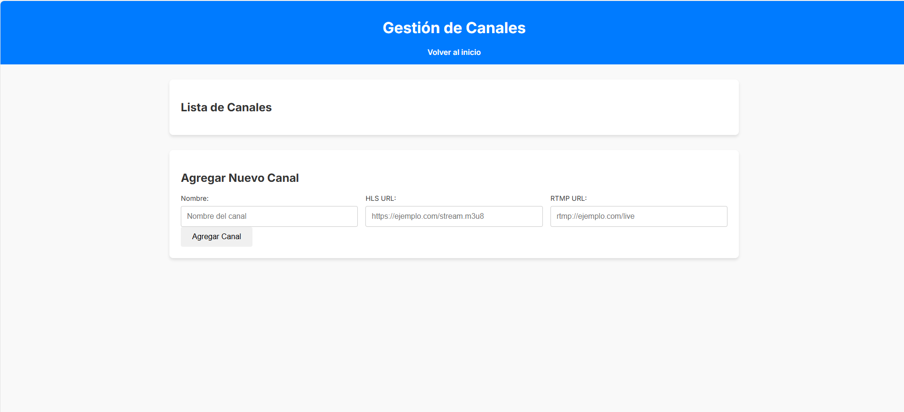

# Instalación del servidor desde cero

## 1. Instalar Node Version Manager (NVM) y configurar Node.js v20 por defecto

Ejecuta los siguientes comandos para instalar **NVM** y Node.js:

```bash
curl -o- https://raw.githubusercontent.com/nvm-sh/nvm/v0.39.0/install.sh | bash
source ~/.bashrc
nvm install 20
```

## 2. Clonar el repositorio e instalar dependencias

1. Ve al directorio `/home` (recomendado):
   ```bash
   cd /home
   ```

2. Clona el repositorio del proyecto:
   ```bash
   git clone https://github.com/armando19993/dashboar-control-transmision.git trasmision
   ```

3. Ingresa al directorio clonado:
   ```bash
   cd trasmision
   ```

4. Instala los paquetes necesarios:
   ```bash
   npm install
   ```

## 3. Probar el servidor

1. Ejecuta el servidor:
   ```bash
   node server.js
   ```

2. Abre tu navegador y accede al servidor usando la IP del servidor seguida del puerto `3000`:
   ```
   http://ipServer:3000
   ```

## 4. Solución de errores comunes

### Error: Archivo `channels.json` faltante
Si encuentras un error similar al siguiente:



Debes crear el archivo `channels.json`. Hazlo con el siguiente comando:

```bash
nano channels.json
```

Dentro del archivo, agrega el siguiente contenido:

```json
[]
```

Guarda el archivo y vuelve a probar accediendo al servidor:

```http
http://ipServer:3000
```

## 5. Prueba del servidor

1. Crea un canal desde la interfaz.
2. Inicia el canal para confirmar que todo funcione correctamente.



